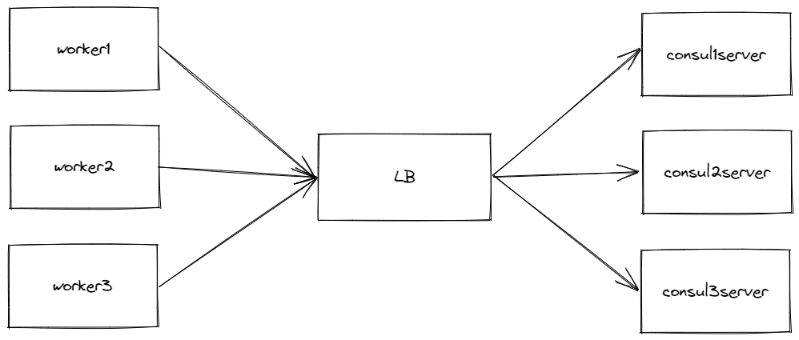

# Terraform Consul Cluster on Azure

## Prerequisites
Run below commands on Azure:
```sh
# Create resource group
az group create -n rg-consul-cluster -l westeurope

# Crete storage account
az storage account create -n saconsulcluster -g rg-consul-cluster -l westeurope --sku Standard_LRS

# Create container
az storage container create --account-name saconsulcluster -n container-consul-cluster

# Create Service Principal 
az ad sp create-for-rbac --name dvlpmike-consul-cluster

# Add role for app
az role assignment create --assignee <service-principal-id> --role "Contributor"
```
Add secretes do repo:
- `AZURE_CLIENT_ID`
- `AZURE_SUBSCRIPTION_ID`
- `AZURE_TENANT_ID`
- `AZURE_AD_CLIENT_SECRET`
- `AZURE_PUBLIC_KEY`
- `AZURE_SSH_USER`
